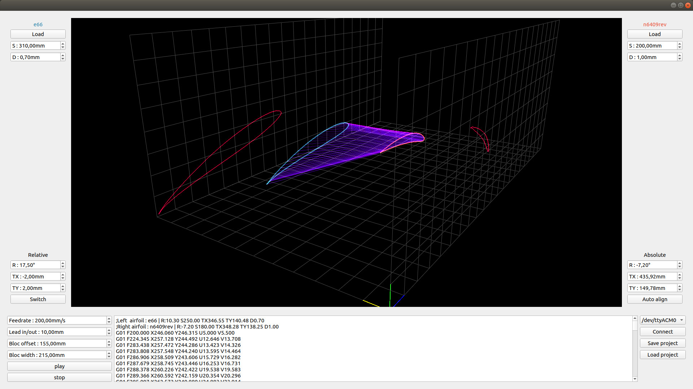

# Pywing



Pywing is a all-in-one software for hot wire foam CNC cutting. It can generate G-Code for other softwares or directly communicate with a 4-axis(XYUV) Grbl through serial link (see https://github.com/proto3/grbl/tree/hotwire).

It has no drop down menus, so everything you need is visible. Just try scrolling on each field and you will see instantly what it does in the 3D view.

## How to use it ?

First of all, clone the repository and open a terminal inside pywing folder.

Follow this instructions to create a virtualenv and install required packages inside it (or just install packages in requirements.txt with the package manager you're used to):
```shell
# install virtualenv (use your dist packages manager if not apt)
sudo apt-get install virtualenv

# create a python3 virtualenv inside pywing folder
virtualenv -p python3 env

# activate your virtualenv
source env/bin/activate

# install pywing dependencies inside it
pip install -r requirements.txt

# run pywing
./pywing.py

# deactivate your virtualenv
deactivate
```
